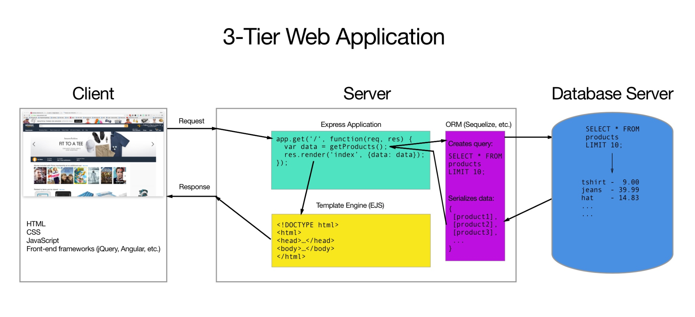
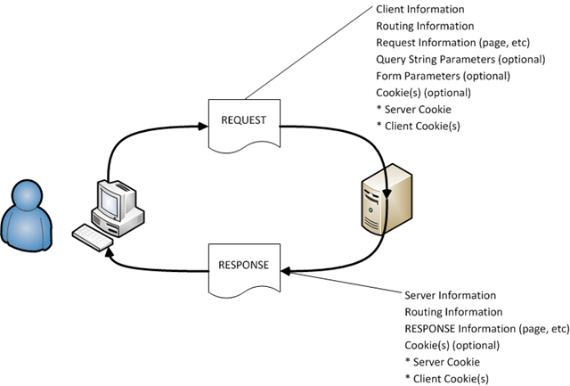
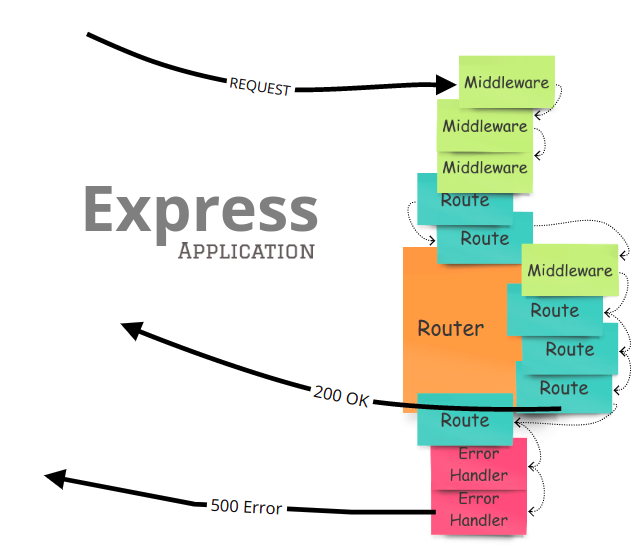

# RESTful Routing with Express!

### 1. How does web interaction work?
- A client or user interacts with our frontend.
- Their interaction is processed on the backend and we have a script that responds with something.



<br>

### 2. Request/Response Cycle
- Each route in an Express or CRUD application can do something with both a request and a response.
- Request = what is coming from the user + any data a user is sending.
- Response = whatever we are sending back to the frontend/user.

<br>

*Example of the Request/Response Cycle:*


*Example of the Request/Response Cycle in Express:*


<br>

- In Express whatever is attached to the request or the response gets passed to our route declaration.
- Best practice = declare the request object as `req`, and the response object as `res`.
- Each of these variables (req and res) have a handful of methods that can be called on them that are built into Express (for more: see resource list at bottom of lesson). 

<br>

### 3. CRUD
Our routes can do one of four things with each request or response:
- Create
- Read
- Update
- Destroy

<br>

*What does this mean for our Express application?*
- Each route in Express takes in both a request and a response.
- For that request or response it can perform one of four actions (CRUD).

<br>

*Examples:*
- **Create**: Route takes in a request that sends a user signup, and responds with a 200 if successful, an error if the user already has an account with us.
- **Read**: Route takes in a request (the user clicked a button) that returns in a response a list of all relevant data the user requested.
- **Update**: Route takes in a request from a user via a form input to update their password, and returns a response based on if successful or not.
- **Destroy**: User sends request to delete profile with applications, and response is sent based on if successful or not.

<br>

#### For each of these potential actions, there is a matching VERB or REQUEST METHOD.
- Create = POST
- Read = GET
- Update = PUT
- Destroy = DELETE

<br>

### 4. RESTful Routing
- REST = Representational State Transfer
- Fancy term to describe a common methodology/organizational pattern for setting up the routes on your page.
- Each route should do one action for each verb.

<br>

*Example RESTful Routing Chart:*
| VERB | URL | Action | Description |
|------|-----|---------------|-------------|
| GET | /dinosaurs | Read | Lists all dinosaurs. |
| GET | /dinosaurs/new | Read | Shows a form to create a dinosaur. |
| POST | /dinosaurs/new | Create | Creates a dinosaur with the POST payload data. |
| GET | /dinosaurs/:id | Read | Lists information about a specific dinosaur. |
| GET | /dinosaurs/edit/:id | Read | Shows a form for editing a specific dinosaur. |
| PUT | /dinosaurs/edit/:id | Update | Updates the data for a specific dinosaur. |
| DELETE | /dinosaurs/delete/:id | Delete | Deletes the dinosaur with the specified id. |

<br>

### Group Practice: Create a RESTful routing chart for a dog website.

<br>

Using the example chart above, create an example RESTful routing chart for a website that allows users to look at and manipulate data about types of dogs. 

The chart should allow for the routes listed in the example above. 

Each route should allow for whatever routes would be used in an app or website built on a RESTful methodology.

<br>

```
Type dog {
    id,
    breed,
    name
}
```

<br>

Example datapoint: 1, Bouvier, Bear.

<br>

| VERB | URL | Action | Description |
|------|-----|---------------|-------------|
| GET | /dogs | Read | A list of all the dogs in my database. |
| GET | /dogs/new | Read | HTML and CSS with the form to add the breed and name for my new dog. |
| POST | /dogs/new | Create | Creates a new dog with the form info in my database. |
| GET | /dogs/:id | Read | Get info on a dog with a specific id. |
| GET | /dogs/edit/:id | Read | Get HTML and CSS to display a form to edit a dog at the specific id. |
| PUT | /dogs/edit/:id | Update | Updates the database row on this id object. |
| DELETE | /dogs/delete/:id | Delete | Delete the database row for this id object. |

<br>

*Sources:*
- Gitbooks for GA SEI (https://gawdiseattle.gitbook.io/wdi/05-node-express)
- The req object via Alligator.io (https://alligator.io/nodejs/req-object-in-expressjs/)
- The res object via Alligator.io (https://alligator.io/nodejs/res-object-in-expressjs/)